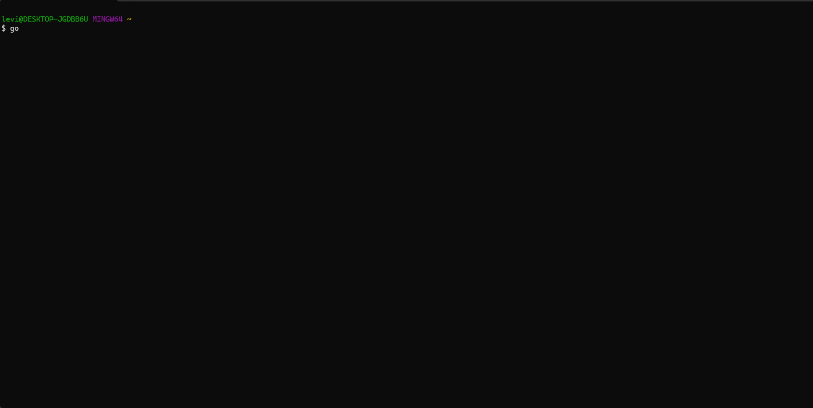

# goed2k

[](https://github.com/goed2k/core/actions/workflows/ci.yml)

`goed2k` 是一个用 Go 编写的 ED2K/eMule 客户端库，附带一个可交互的终端下载管理器。



## AI 参与开发

这个项目主要由 AI 辅助完成，使用的工具包括：

- `Codex`
- `ChatGPT 5.4`

实现过程中主要参考了仓库内的两个开源项目：

- `jed2k`
- `amule`

## 特性

`goed2k` 目前已经覆盖了一套可用的 ED2K/eMule 客户端能力，主要包括：

- [x] ED2K 文件下载与多任务并发
- [x] 多个 ED2K server 并发找源与 `server.met` 加载
- [x] KAD（Kad4）bootstrap、搜源与完成发布
- [x] **KADV6**（IPv6 DHT）搜源、发布与 TUI/CLI 开关
- [x] UPNP 端口映射（含混淆 TCP 与 KADV6 UDP）
- [x] 客户端间来源交换（Source Exchange）
- [x] Server / Kad Callback（低 ID 穿透）
- [x] 协议混淆 CryptLayer（默认关闭，库 API 可启用）
- [x] AICH 损坏块检测与恢复
- [x] Secure Ident 安全身份（默认关闭）
- [x] 上传 zlib 压缩与下载限速
- [x] 本地共享库、Server OfferFiles、KAD/KADV6 发布
- [x] Kad 关键字/Notes 搜索、Collection 链接
- [x] 任务优先级、分类路由、IP 过滤与封禁
- [x] 状态持久化与恢复、`.part.met` JSON 导出
- [x] 可交互终端下载管理器（TUI）
- [x] Web API 服务（`goed2k-web`）

## 相关文档

- [库 API 使用指南（中文）：嵌入调用、Client/Session、快照与订阅](docs/library-api-CN.md)
- [本地共享库与周边能力：分阶段实现说明（中文）](docs/library-implementation-phases-CN.md)
- [Kademlia v6 协议说明（中文）](docs/kadv6-protocol-CN.md)
- [客户端来源交换（Source Exchange）实现说明（中文）](docs/source-exchange-CN.md)
- [Secure Ident 计划](docs/secure-ident-plan.md)
- [版本变更记录（CHANGELOG）](CHANGELOG.md)

## 开发与测试

```bash
# 默认单元测试（跳过外网联调与外部 fixture）
go test -race -count=1 ./...

# 运行外网联调测试（需可访问 ED2K 网络）
GOED2K_RUN_LIVE_TESTS=1 go test -run LiveDownload -count=1 .
```

推送至 `main` 或提交 Pull Request 时，GitHub Actions 会自动运行 `go vet`、全量单元测试与构建检查。

## 安装

### 可执行文件

```bash
go install github.com/goed2k/core/cmd/goed2k@latest
```

### 作为库

```bash
go get github.com/goed2k/core
```

## 快速开始

### 运行终端下载管理器

```bash
goed2k
```

如果你想直接从源码运行：

```bash
go run ./cmd/goed2k
```

## 库使用示例

```go
package main

import (
	"log"

	"github.com/goed2k/core"
)

func main() {
	settings := goed2k.NewSettings()
	settings.ReconnectToServer = true
	settings.EnableUPnP = true

	client := goed2k.NewClient(settings)
	if err := client.Start(); err != nil {
		log.Fatal(err)
	}
	defer client.Close()

	if err := client.ConnectServers("176.123.5.89:4725", "45.82.80.155:5687"); err != nil {
		log.Fatal(err)
	}

	if _, _, err := client.AddLink(
		"ed2k://|file|example-file.mp3|12345678|0123456789ABCDEF0123456789ABCDEF|/",
		"./downloads",
	); err != nil {
		log.Fatal(err)
	}

	if err := client.Wait(); err != nil && err != goed2k.ErrClientStopped {
		log.Fatal(err)
	}
}
```

## License

本项目采用 MIT License。

你可以在保留原始版权声明和许可声明的前提下，自由使用、复制、修改、合并、发布、分发、再许可和销售本项目的副本。项目按“现状”提供，作者不对其适用性或稳定性作任何明示或暗示担保。
